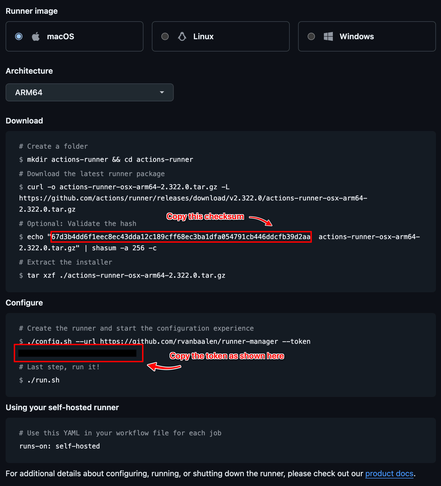

# runner-manager

A CLI tool to manage GitHub self-hosted runners on your machine.

# Installation

Optionally, you can install this package globally
`npm install -g runner-manager`

# Usage

Create a folder in which you're going to keep your Github Action runner files. In this 
folder, the CLI will also create a cache folder and optionally save the config file.

`cd ~/Projects && mkdir github-runners && cd github-runners`

Now, inside the newly created folder, start the CLI:

```bash
npx runner-manager
``` 

or 

```bash
runner-manager
``` 

if you installed globally.

You’ll be presented with a menu:

1. Start runners – Starts all configured runners.
1. Quit runners – Stops all running runners.
1. Add new runner – Guides you through setting up a new runner.

## 1. Start runners
This will execute the `./run.sh` script in every `runner-[number]` subfolder. And this 
way, you can easily fire up multiple GitHub Action runners with a single command.

## 2. Quit runners
> ⚠️ This will terminate the process and might interrupt any running jobs

Shut down any runners that are currently active. Make sure your runners are currently idle. 

## 3. Add a new runner

## GitHub Runner Settings Screenshot

Here is an example screenshot of the settings:



> ℹ️ The defaults are based on the, as of this time, current version.
> Feel free to send a PR when these need to be updated.

The CLI will prompt you for several inputs:
- **Version**: GitHub Actions Runner version (default: `2.322.0`).
- **SHA**: Checksum for the runner package.
- **GitHub Token**: Your GitHub runner token* (required).
- **Repo**: The repository in owner/repo format (required).
- **Runner Name**: A custom name for the runner.
- **Platform**: The OS this runner will be on (macOS or Linux, default: macOS).
- **Architecture**:
- - **For macOS**: Options are x64 or ARM64 (default: ARM64).
- - **For Linux**: Options are x64, ARM, or ARM64 (default: x64).

_* The token that is being referred to here, is the token as being shown in the config step _

Based on these inputs, the CLI downloads the appropriate runner tarball using the following pattern:

`actions-runner-[osx/linux]-[lowercase architecture]-[version].tar.gz`

# Configuration and settings defaults

If a `runners.config.json` file is present in the current directory, its values will be used as defaults. 
Otherwise, after adding a new runner is added, you’ll be prompted to save the current settings as 
defaults in a new `runners.config.json` file for future use.

# Cleanup

If any command fails during runner setup, the script automatically cleans up by removing the runner folder.

# License

See LICENSE file

Happy self-hosting! 🤖
 
